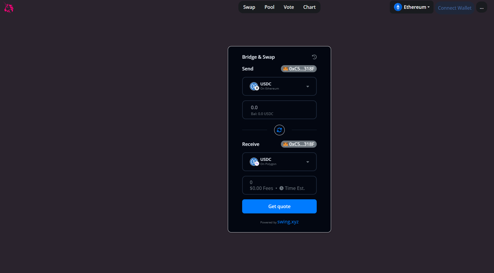

# Uniswap Clone using Swing Widget
This project demonstrates how you can create a Uniswap clone using Swings Widget.

## Set up
Install the template with 
- Create a free account with [Swing Platform](https://platform.swing.xyz/).
- Setup your project and copy your unique project Identifier.
- Update the project ID in the 'app.component.ts' file to use your widget.

### Run Locally

Install dependencies:

```bash
yarn
```

Start the server:

```bash
yarn start
```

## Additional Resources

- [Documentation](https://developers.swing.xyz/)
- [Templates](https://thirdweb.com/templates)